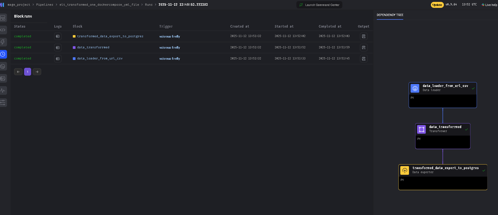

# 🚀 Dockerized ELT Pipeline

🐍 Python | 🐘 PostgreSQL | 🔄 Mage AI | 🐳 Docker

A production-ready data pipeline that extracts wine quality data, transforms it with Mage AI, and loads it into PostgreSQL—all containerized.

## Why this matters

### Modern ELT Architecture - 
This is the contemporary approach where raw data loads first, then transforms in the warehouse—more scalable and flexible.

### Full Containerization 
Everything runs in Docker. This means zero environment setup friction—developers just docker-compose up and it works everywhere (Windows, Mac, Linux).

### Low-Code Orchestration
Using Mage AI (low-code) instead of writing complex Airflow DAGs makes this more accessible and maintainable.

### End-to-End Workflow 
This a complete data story: ingestion → transformation → storage → visualization in a small projects.

## Quick Start

```bash
cd src
docker-compose up -d
```

- **Mage UI**: http://localhost:7801
- **PostgreSQL**: localhost:5432

## Setup Environment Variables

Create a `.env` file in `src/`:

```env
POSTGRES_USER=postgres
POSTGRES_PASSWORD=your_secure_password
POSTGRES_DB=wine
```

Update `docker-compose.yml` to use variables:

```yaml
environment:
  POSTGRES_USER: ${POSTGRES_USER}
  POSTGRES_PASSWORD: ${POSTGRES_PASSWORD}
  POSTGRES_DB: ${POSTGRES_DB}
```

## Stack

- Extract: Public Wine Quality Dataset
- Transform: Mage AI pipelines
- Load: PostgreSQL
- Visualize: Azure Data Studio

## Files

- `elt.py` - ETL logic
- `docker-compose.yml` - Infrastructure
- `.env` - Secrets (add to .gitignore)

---

**⚠️ Security**: Never commit `.env` or database credentials!


## How Mage AI Pipeline looks like 

